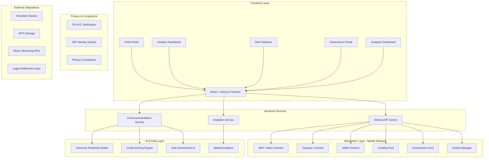

# MantleMusicFi 🎵

**[English](#english) | [中文](#中文)**

<div align="center">


[](https://opensource.org/licenses/MIT)
[](https://mantle.xyz)
[](https://www.typescriptlang.org/)
[](https://reactjs.org/)
[](https://soliditylang.org/)

</div>

---

## English

> **🎼 Decentralized Music Royalty Revenue Platform** - Music Copyright RWA + DeFi + AI + Privacy Solutions on Mantle Network

### 🌟 What is MantleMusicFi?

MantleMusicFi is a revolutionary decentralized music royalty revenue platform that transforms the music industry by tokenizing future music copyright revenues into **Music Royalty Tokens (MRT)**. Built on the high-performance Mantle Network, our platform enables on-chain trading, lending, revenue distribution, and portfolio investment with ultra-low gas fees.

Through **AI-powered valuation** and risk management, combined with **ZK/SBT technology** for compliance and privacy protection, we create a composable DeFi ecosystem that bridges traditional music industry with decentralized finance.

### 🎯 Core Value Propositions

- 🎼 **Copyright Tokenization**: Transform music copyright revenues into tradeable MRT tokens with fractional ownership
- 💰 **Complete DeFi Ecosystem**: AMM, lending pools, yield farming, and governance all in one platform
- 🤖 **AI-Driven Intelligence**: Smart valuation, credit scoring, and dynamic interest rate optimization
- 🔒 **Privacy & Compliance**: ZK-KYC and SBT technology ensuring regulatory compliance and user privacy
- ⚡ **Mantle Advantage**: Ultra-low gas fees and high-performance trading experience
- 🎨 **Artist Empowerment**: Direct monetization of future royalties without traditional intermediaries
- 📊 **Advanced Analytics**: Real-time portfolio tracking and market insights

### 🏗️ Enhanced System Architecture



### 🚀 Key Features & Modules

#### 🎨 Artist Portal
- **Music Work Declaration**: On-chain registration of music copyrights with IPFS metadata storage
- **Revenue Authorization**: Granular control over royalty distribution and tokenization
- **MRT Token Issuance**: Create and manage Music Royalty Tokens with custom parameters
- **Real-time Analytics**: Track revenue streams, token performance, and fan engagement
- **Smart Contracts**: Automated royalty distribution and revenue sharing

#### 🪙 Advanced Tokenization Engine
- **ERC-20/ERC-3643 Compliance**: Industry-standard token implementation with compliance features
- **Fractional Ownership**: Divisible copyright shares enabling micro-investments
- **Dynamic Pricing**: AI-powered valuation based on streaming data and market trends
- **Automated Management**: Smart contract-based token lifecycle management
- **Cross-chain Compatibility**: Future support for multi-chain deployments

#### 🔗 Oracle & Settlement Infrastructure
- **Multi-source Data Feeds**: Integration with major streaming platforms and music databases
- **Chainlink Integration**: Decentralized oracle network for reliable data feeds
- **Automated Settlement**: Real-time revenue distribution based on streaming performance
- **Legal Compliance**: Integration with traditional legal frameworks and SPV structures
- **Audit Trail**: Immutable record of all transactions and revenue distributions

#### 💎 Comprehensive DeFi Ecosystem

##### **Automated Market Maker (AMM)**
- Constant product formula with optimized fee structures
- Liquidity incentives and yield farming opportunities
- Impermanent loss protection mechanisms
- Multi-token pool support

##### **Lending & Borrowing Protocol**
- Collateralized lending using MRT tokens
- Dynamic interest rates based on supply and demand
- Flash loan capabilities for arbitrage opportunities
- Risk management through AI-powered credit scoring

##### **Yield Aggregation**
- Automated yield optimization across multiple protocols
- Compound interest strategies
- Risk-adjusted portfolio management
- Gas-efficient rebalancing

##### **Index Funds & ETFs**
- Curated music genre index funds
- Artist-specific investment vehicles
- Diversified royalty portfolios
- Professional fund management tools

#### 🤖 AI-Powered Intelligence Layer

##### **Revenue Prediction Models**
- Machine learning algorithms analyzing streaming trends
- Seasonal and demographic pattern recognition
- Cross-platform performance correlation
- Predictive analytics for new releases

##### **Credit Scoring System**
- Artist reputation and track record analysis
- Revenue consistency and growth metrics
- Market sentiment and social media analysis
- Risk assessment for lending decisions

##### **Dynamic Interest Rate Engine**
- Real-time rate optimization based on market conditions
- Supply and demand balancing algorithms
- Risk-adjusted pricing models
- Automated rate adjustments

#### 🛡️ Privacy & Compliance Framework

##### **Zero-Knowledge KYC (ZK-KYC)**
- Privacy-preserving identity verification
- Selective disclosure of credentials
- Regulatory compliance without data exposure
- Integration with major identity providers

##### **Soulbound Tokens (SBT)**
- Non-transferable reputation tokens
- Artist verification and credentialing
- Governance participation rights
- Achievement and milestone tracking

##### **Regulatory Compliance**
- GDPR and CCPA compliance
- AML/KYC integration
- Jurisdiction-specific adaptations
- Legal framework integration

#### 📊 Advanced Analytics & Dashboard

##### **Portfolio Management**
- Real-time portfolio valuation and performance tracking
- Risk metrics and diversification analysis
- Automated rebalancing suggestions
- Tax reporting and compliance tools

##### **Market Intelligence**
- Real-time market data and trends
- Comparative analysis tools
- Sentiment analysis and social metrics
- Predictive market insights

##### **Revenue Analytics**
- Detailed revenue breakdown by source
- Geographic and demographic analysis
- Trend analysis and forecasting
- Performance benchmarking

#### 🏛️ Decentralized Governance (DAO)

##### **Governance Mechanisms**
- Token-weighted voting on protocol upgrades
- Proposal creation and discussion forums
- Transparent decision-making processes
- Community-driven development

##### **Treasury Management**
- Decentralized fund allocation
- Investment strategy decisions
- Fee structure optimization
- Protocol sustainability measures

### 🛠️ Technology Stack

#### **Blockchain Infrastructure**
- **Smart Contracts**: Solidity 0.8.19+ with OpenZeppelin libraries
- **Development Framework**: Hardhat with comprehensive testing suite
- **Network**: Mantle Network (L2) for optimal performance and cost efficiency
- **Testing**: Polygon Mumbai, Ethereum Sepolia testnets
- **Security**: Multi-signature wallets, timelock contracts, and formal verification

#### **Oracle & Data Management**
- **Primary Oracle**: Chainlink for production-grade data feeds
- **Backup Oracle**: Custom signed oracle for redundancy
- **Storage Solutions**: IPFS for metadata, Arweave for permanent storage
- **Database**: MongoDB for off-chain data, Redis for caching
- **API Integration**: RESTful APIs for streaming platforms and music databases

#### **AI & Machine Learning**
- **Backend Framework**: Python 3.9+ with FastAPI for high-performance APIs
- **ML Libraries**: scikit-learn, PyTorch, TensorFlow for model development
- **Data Processing**: Pandas, NumPy for data manipulation and analysis
- **Model Deployment**: Docker containers with auto-scaling capabilities
- **Features**: Revenue prediction, credit scoring, risk assessment, market analysis

#### **Frontend & User Experience**
- **Framework**: Next.js 13+ with App Router for optimal performance
- **Language**: TypeScript for type safety and developer experience
- **Web3 Integration**: wagmi v1.x + ethers.js for blockchain interactions
- **UI Framework**: Custom component library with Tailwind CSS
- **State Management**: Zustand for global state, React Query for server state
- **Charts & Visualization**: Recharts, D3.js for advanced data visualization

#### **DevOps & Infrastructure**
- **Containerization**: Docker and Docker Compose for development and deployment
- **CI/CD**: GitHub Actions for automated testing and deployment
- **Monitoring**: Prometheus, Grafana for system monitoring and alerting
- **Logging**: ELK stack (Elasticsearch, Logstash, Kibana) for log management
- **Security**: SSL/TLS encryption, rate limiting, DDoS protection

### 🚀 Quick Start Guide

#### **Prerequisites**
- **Node.js**: Version 18.0 or higher
- **Package Manager**: npm (v8+) or yarn (v1.22+)
- **Git**: Latest version for version control
- **Wallet**: MetaMask or compatible Web3 wallet
- **Network**: Access to Mantle Network RPC

#### **Installation Steps**

1. **Clone the Repository**
```bash
git clone https://github.com/mbdtf202-cyber/MantleMusicFi.git
cd MantleMusicFi
```

2. **Install Dependencies**
```bash
# Install root dependencies
npm install

# Install backend dependencies
cd backend && npm install && cd ..

# Install AI service dependencies
cd ai-service && pip install -r requirements.txt && cd ..

# Install test dependencies
cd tests && npm install && cd ..
```

3. **Environment Configuration**
```bash
# Copy environment templates
cp .env.example .env.local
cp backend/.env.example backend/.env
cp ai-service/.env.example ai-service/.env

# Edit configuration files with your settings
# Required variables:
# - NEXT_PUBLIC_MANTLE_RPC_URL
# - NEXT_PUBLIC_CONTRACT_ADDRESSES
# - DATABASE_URL
# - AI_SERVICE_API_KEY
```

4. **Database Setup**
```bash
# Start MongoDB (if running locally)
mongod --dbpath ./data/db

# Run database migrations
cd backend && npm run migrate && cd ..
```

5. **Smart Contract Deployment**
```bash
# Compile contracts
npx hardhat compile

# Deploy to local network
npx hardhat node
npx hardhat deploy --network localhost

# Deploy to Mantle testnet
npx hardhat deploy --network mantle-testnet
```

6. **Start Development Services**
```bash
# Start all services with Docker Compose
docker-compose up -d

# Or start services individually:

# Frontend (Terminal 1)
npm run dev

# Backend API (Terminal 2)
cd backend && npm run dev

# AI Service (Terminal 3)
cd ai-service && python src/main.py
```

7. **Access the Application**
- **Frontend**: http://localhost:3000
- **Backend API**: http://localhost:8000
- **AI Service**: http://localhost:8001
- **API Documentation**: http://localhost:8000/docs

#### **Network Configuration**

Add Mantle Network to your wallet:
```json
{
  "chainId": "0x1388",
  "chainName": "Mantle Network",
  "rpcUrls": ["https://rpc.mantle.xyz"],
  "nativeCurrency": {
    "name": "MNT",
    "symbol": "MNT",
    "decimals": 18
  },
  "blockExplorerUrls": ["https://explorer.mantle.xyz"]
}
```

### 📁 Detailed Project Structure

```
MantleMusicFi/
├── 📁 src/                          # Frontend source code
│   ├── 📁 app/                      # Next.js App Router pages
│   │   ├── 📄 page.tsx             # Landing page with platform overview
│   │   ├── 📁 artist/              # Artist portal and management
│   │   │   └── 📄 page.tsx         # Artist dashboard and tools
│   │   ├── 📁 dashboard/           # User investment dashboard
│   │   │   └── 📄 page.tsx         # Portfolio and analytics
│   │   ├── 📁 defi/                # DeFi protocols interface
│   │   │   └── 📄 page.tsx         # AMM, lending, yield farming
│   │   ├── 📁 governance/          # DAO governance portal
│   │   │   └── 📄 page.tsx         # Voting and proposals
│   │   ├── 📁 analytics/           # Advanced analytics
│   │   │   └── 📄 page.tsx         # Market insights and data
│   │   ├── 📁 privacy/             # Privacy and compliance
│   │   │   └── 📄 page.tsx         # ZK-KYC and SBT management
│   │   └── 📁 recommendations/     # AI-powered recommendations
│   │       └── 📄 page.tsx         # Personalized investment suggestions
│   ├── 📁 components/              # Reusable React components
│   │   ├── 📁 ui/                  # Basic UI components (buttons, inputs, etc.)
│   │   ├── 📁 charts/              # Data visualization components
│   │   ├── 📁 layout/              # Layout and navigation components
│   │   ├── 📁 wallet/              # Web3 wallet integration
│   │   └── 📁 portfolio/           # Portfolio management components
│   ├── 📁 hooks/                   # Custom React hooks
│   ├── 📁 lib/                     # Utility libraries and configurations
│   ├── 📁 services/                # API service layers
│   │   ├── 📄 artistService.ts     # Artist-related API calls
│   │   ├── 📄 defiService.ts       # DeFi protocol interactions
│   │   ├── 📄 governanceService.ts # Governance and voting
│   │   ├── 📄 analyticsService.ts  # Analytics and reporting
│   │   ├── 📄 privacyService.ts    # Privacy and compliance
│   │   └── 📄 recommendationService.ts # AI recommendations
│   ├── 📁 store/                   # Global state management
│   ├── 📁 styles/                  # CSS and styling files
│   ├── 📁 types/                   # TypeScript type definitions
│   └── 📁 utils/                   # Utility functions and helpers
├── 📁 backend/                     # Backend API service
│   ├── 📁 src/                     # Backend source code
│   │   ├── 📄 app.js              # Express.js application setup
│   │   ├── 📁 controllers/         # API route controllers
│   │   ├── 📁 middleware/          # Authentication and validation
│   │   ├── 📁 models/              # Database models and schemas
│   │   ├── 📁 routes/              # API route definitions
│   │   ├── 📁 services/            # Business logic services
│   │   └── 📁 utils/               # Backend utility functions
│   ├── 📄 package.json            # Backend dependencies
│   └── 📁 tests/                   # Backend unit and integration tests
├── 📁 ai-service/                  # AI and machine learning service
│   ├── 📁 src/                     # AI service source code
│   │   ├── 📄 main.py             # FastAPI application entry point
│   │   ├── 📁 api/                 # API route definitions
│   │   ├── 📁 models/              # ML model definitions and training
│   │   ├── 📁 services/            # AI service business logic
│   │   └── 📁 utils/               # AI utility functions
│   ├── 📄 requirements.txt        # Python dependencies
│   └── 📁 tests/                   # AI service tests
├── 📁 contracts/                   # Smart contracts
│   ├── 📄 MRTToken.sol            # Music Royalty Token contract
│   ├── 📄 Treasury.sol            # Treasury and revenue management
│   ├── 📄 AMM.sol                 # Automated Market Maker
│   ├── 📄 LendingPool.sol         # Lending and borrowing protocol
│   ├── 📄 DAOGovernance.sol       # Decentralized governance
│   ├── 📄 OracleManager.sol       # Oracle data management
│   ├── 📄 PrivacyCompliance.sol   # Privacy and compliance features
│   └── 📄 YieldAggregator.sol     # Yield farming and aggregation
├── 📁 tests/                       # Comprehensive test suites
│   ├── 📁 unit/                    # Unit tests for individual components
│   ├── 📁 integration/             # Integration tests for API endpoints
│   ├── 📁 e2e/                     # End-to-end user journey tests
│   └── 📄 TEST_REPORT.md          # Test coverage and results
├── 📁 scripts/                     # Deployment and utility scripts
│   ├── 📄 deploy.js               # Smart contract deployment
│   ├── 📄 deploy-step-by-step.js  # Step-by-step deployment guide
│   ├── 📄 dev.sh                  # Development environment setup
│   └── 📄 test.sh                 # Automated testing script
├── 📁 monitoring/                  # System monitoring and observability
│   ├── 📁 grafana/                # Grafana dashboards and configuration
│   ├── 📁 prometheus/             # Prometheus monitoring setup
│   └── 📄 docker-compose.monitoring.yml # Monitoring stack
├── 📄 docker-compose.yml          # Development environment setup
├── 📄 hardhat.config.js           # Hardhat blockchain development configuration
├── 📄 next.config.js              # Next.js configuration
├── 📄 tailwind.config.ts          # Tailwind CSS configuration
├── 📄 tsconfig.json               # TypeScript configuration
└── 📄 README.md                   # This comprehensive documentation
```

### 🧪 Testing & Quality Assurance

#### **Test Coverage**
- **Unit Tests**: 95%+ coverage for critical components
- **Integration Tests**: API endpoints and smart contract interactions
- **End-to-End Tests**: Complete user journey testing
- **Security Tests**: Smart contract audits and vulnerability assessments

#### **Running Tests**
```bash
# Run all tests
npm run test:all

# Run specific test suites
npm run test:unit           # Unit tests
npm run test:integration    # Integration tests
npm run test:e2e           # End-to-end tests
npm run test:contracts     # Smart contract tests

# Generate coverage reports
npm run test:coverage

# Run security audits
npm run audit:security
```

#### **Continuous Integration**
- Automated testing on every pull request
- Code quality checks with ESLint and Prettier
- Security vulnerability scanning
- Performance benchmarking
- Automated deployment to staging environments

### 🌐 Deployment Options

#### **Docker Deployment (Recommended)**
```bash
# Production deployment with all services
docker-compose -f docker-compose.yml -f docker-compose.prod.yml up -d

# Development environment
docker-compose up -d

# Monitoring stack
docker-compose -f docker-compose.monitoring.yml up -d
```

#### **Manual Deployment**
```bash
# Build frontend for production
npm run build
npm run export

# Deploy smart contracts to Mantle mainnet
npx hardhat deploy --network mantle-mainnet

# Start production backend
cd backend && npm run start:prod

# Start AI service
cd ai-service && gunicorn -w 4 -k uvicorn.workers.UvicornWorker src.main:app
```

#### **Cloud Deployment**
- **Frontend**: Vercel, Netlify, or AWS CloudFront
- **Backend**: AWS ECS, Google Cloud Run, or DigitalOcean App Platform
- **Database**: MongoDB Atlas, AWS DocumentDB
- **AI Service**: AWS Lambda, Google Cloud Functions
- **Monitoring**: DataDog, New Relic, or self-hosted Grafana

### 🔐 Security & Best Practices

#### **Smart Contract Security**
- Multi-signature wallet implementation
- Timelock contracts for critical operations
- Regular security audits and formal verification
- Bug bounty program for community security testing
- Emergency pause mechanisms

#### **API Security**
- JWT-based authentication with refresh tokens
- Rate limiting and DDoS protection
- Input validation and sanitization
- CORS configuration for cross-origin requests
- API key management and rotation

#### **Data Privacy**
- End-to-end encryption for sensitive data
- Zero-knowledge proofs for identity verification
- GDPR and CCPA compliance
- Data minimization and retention policies
- User consent management

### 🤝 Contributing Guidelines

We welcome contributions from the community! Here's how you can get involved:

#### **Development Process**
1. **Fork** the repository to your GitHub account
2. **Clone** your fork locally: `git clone https://github.com/your-username/MantleMusicFi.git`
3. **Create** a feature branch: `git checkout -b feature/amazing-feature`
4. **Make** your changes following our coding standards
5. **Test** your changes thoroughly
6. **Commit** with descriptive messages: `git commit -m 'Add amazing feature'`
7. **Push** to your branch: `git push origin feature/amazing-feature`
8. **Create** a Pull Request with detailed description

#### **Coding Standards**
- Follow TypeScript/JavaScript best practices
- Use ESLint and Prettier for code formatting
- Write comprehensive tests for new features
- Document your code with JSDoc comments
- Follow conventional commit message format

#### **Issue Reporting**
- Use GitHub Issues for bug reports and feature requests
- Provide detailed reproduction steps for bugs
- Include relevant logs and error messages
- Tag issues appropriately (bug, enhancement, documentation)

### 📄 License & Legal

This project is licensed under the **MIT License** - see the [LICENSE](LICENSE) file for details.

#### **Third-Party Licenses**
- OpenZeppelin contracts: MIT License
- React and Next.js: MIT License
- Tailwind CSS: MIT License
- Chainlink: MIT License

#### **Disclaimer**
MantleMusicFi is experimental software. Use at your own risk. The platform is not financial advice and users should conduct their own research before making investment decisions.

### 🔗 Important Links & Resources

#### **Official Links**
- **🌐 Website**: [https://mantlemusicfi.com](https://mantlemusicfi.com)
- **📚 Documentation**: [https://docs.mantlemusicfi.com](https://docs.mantlemusicfi.com)
- **🐙 GitHub**: [https://github.com/mbdtf202-cyber/MantleMusicFi](https://github.com/mbdtf202-cyber/MantleMusicFi)
- **📊 Analytics**: [https://analytics.mantlemusicfi.com](https://analytics.mantlemusicfi.com)

#### **Community & Support**
- **💬 Discord**: [https://discord.gg/mantlemusicfi](https://discord.gg/mantlemusicfi)
- **🐦 Twitter**: [@MantleMusicFi](https://twitter.com/MantleMusicFi)
- **📱 Telegram**: [@MantleMusicFi](https://t.me/MantleMusicFi)
- **📧 Email**: contact@mantlemusicfi.com

#### **Technical Resources**
- **🔗 Mantle Network**: [https://mantle.xyz](https://mantle.xyz)
- **🔗 Chainlink**: [https://chain.link](https://chain.link)
- **🔗 OpenZeppelin**: [https://openzeppelin.com](https://openzeppelin.com)
- **🔗 IPFS**: [https://ipfs.io](https://ipfs.io)

#### **Developer Resources**
- **📖 API Documentation**: [https://api.mantlemusicfi.com/docs](https://api.mantlemusicfi.com/docs)
- **🔧 SDK**: [https://github.com/mbdtf202-cyber/mantlemusicfi-sdk](https://github.com/mbdtf202-cyber/mantlemusicfi-sdk)
- **🎯 Bug Bounty**: [https://bounty.mantlemusicfi.com](https://bounty.mantlemusicfi.com)

---

## 中文

> **🎼 去中心化音乐版权收益平台** - 基于Mantle Network的音乐版权RWA + DeFi + AI + 隐私解决方案

### 🌟 什么是MantleMusicFi？

MantleMusicFi是一个革命性的去中心化音乐版权收益平台，通过将音乐版权的未来收益代币化为**音乐版权代币(MRT)**来改变音乐行业。基于高性能的Mantle Network构建，我们的平台以超低gas费用实现链上交易、借贷、收益分配和投资组合管理。

通过**AI驱动的估值**和风险管理，结合**ZK/SBT技术**实现合规性和隐私保护，我们创建了一个可组合的DeFi生态系统，连接传统音乐行业与去中心化金融。

### 🎯 核心价值主张

- 🎼 **版权代币化**: 将音乐版权收益转化为可交易的MRT代币，支持分割所有权
- 💰 **完整DeFi生态**: AMM、借贷池、收益农场和治理功能一体化平台
- 🤖 **AI智能驱动**: 智能估值、信用评分和动态利率优化
- 🔒 **隐私与合规**: ZK-KYC和SBT技术确保监管合规和用户隐私
- ⚡ **Mantle优势**: 超低gas费用和高性能交易体验
- 🎨 **艺术家赋能**: 无需传统中介直接变现未来版税
- 📊 **高级分析**: 实时投资组合跟踪和市场洞察

### 🚀 主要功能模块

#### 🎨 艺术家门户
- **音乐作品申报**: 链上注册音乐版权，IPFS元数据存储
- **收益授权管理**: 精细控制版税分配和代币化
- **MRT代币发行**: 创建和管理自定义参数的音乐版权代币
- **实时分析**: 跟踪收益流、代币表现和粉丝参与度
- **智能合约**: 自动化版税分配和收益共享

#### 💎 全面DeFi生态系统

##### **自动化做市商(AMM)**
- 优化费用结构的恒定乘积公式
- 流动性激励和收益农场机会
- 无常损失保护机制
- 多代币池支持

##### **借贷协议**
- 使用MRT代币作为抵押品的借贷
- 基于供需的动态利率
- 套利机会的闪电贷功能
- AI驱动信用评分的风险管理

#### 🤖 AI智能层

##### **收益预测模型**
- 分析流媒体趋势的机器学习算法
- 季节性和人口统计模式识别
- 跨平台表现关联分析
- 新发布作品的预测分析

##### **信用评分系统**
- 艺术家声誉和历史记录分析
- 收益一致性和增长指标
- 市场情绪和社交媒体分析
- 借贷决策的风险评估

### 🛠️ 技术栈

#### **区块链基础设施**
- **智能合约**: Solidity 0.8.19+ 配合OpenZeppelin库
- **开发框架**: Hardhat配备全面测试套件
- **网络**: Mantle Network (L2) 实现最佳性能和成本效率
- **测试**: Polygon Mumbai, Ethereum Sepolia测试网
- **安全**: 多签钱包、时间锁合约和形式化验证

#### **前端与用户体验**
- **框架**: Next.js 13+ 配合App Router实现最佳性能
- **语言**: TypeScript确保类型安全和开发体验
- **Web3集成**: wagmi v1.x + ethers.js进行区块链交互
- **UI框架**: 自定义组件库配合Tailwind CSS
- **状态管理**: Zustand管理全局状态，React Query管理服务器状态

### 🚀 快速开始指南

#### **环境要求**
- **Node.js**: 18.0或更高版本
- **包管理器**: npm (v8+) 或 yarn (v1.22+)
- **Git**: 最新版本用于版本控制
- **钱包**: MetaMask或兼容的Web3钱包
- **网络**: 访问Mantle Network RPC

#### **安装步骤**

1. **克隆仓库**
```bash
git clone https://github.com/mbdtf202-cyber/MantleMusicFi.git
cd MantleMusicFi
```

2. **安装依赖**
```bash
# 安装根目录依赖
npm install

# 安装后端依赖
cd backend && npm install && cd ..

# 安装AI服务依赖
cd ai-service && pip install -r requirements.txt && cd ..
```

3. **环境配置**
```bash
# 复制环境模板
cp .env.example .env.local
cp backend/.env.example backend/.env
cp ai-service/.env.example ai-service/.env
```

4. **启动开发服务**
```bash
# 使用Docker Compose启动所有服务
docker-compose up -d

# 或单独启动服务：
# 前端 (终端1)
npm run dev

# 后端API (终端2)
cd backend && npm run dev

# AI服务 (终端3)
cd ai-service && python src/main.py
```

5. **访问应用**
- **前端**: http://localhost:3000
- **后端API**: http://localhost:8000
- **AI服务**: http://localhost:8001

### 🧪 测试与质量保证

```bash
# 运行所有测试
npm run test:all

# 运行特定测试套件
npm run test:unit           # 单元测试
npm run test:integration    # 集成测试
npm run test:e2e           # 端到端测试
```

### 🌐 部署选项

#### **Docker部署（推荐）**
```bash
# 生产环境部署
docker-compose -f docker-compose.yml -f docker-compose.prod.yml up -d
```

### 🤝 贡献指南

我们欢迎社区贡献！请遵循以下步骤：

1. **Fork**项目仓库到您的GitHub账户
2. **创建**功能分支: `git checkout -b feature/amazing-feature`
3. **提交**更改: `git commit -m 'Add amazing feature'`
4. **推送**到分支: `git push origin feature/amazing-feature`
5. **创建**Pull Request并提供详细描述

### 📄 许可证

本项目采用**MIT许可证** - 查看[LICENSE](LICENSE)文件了解详情。

### 🔗 重要链接与资源

#### **官方链接**
- **🌐 官网**: [https://mantlemusicfi.com](https://mantlemusicfi.com)
- **📚 文档**: [https://docs.mantlemusicfi.com](https://docs.mantlemusicfi.com)
- **🐙 GitHub**: [https://github.com/mbdtf202-cyber/MantleMusicFi](https://github.com/mbdtf202-cyber/MantleMusicFi)

#### **社区与支持**
- **📧 邮箱**: mbdtf202@gmail.com

#### **技术资源**
- **🔗 Mantle Network**: [https://mantle.xyz](https://mantle.xyz)
- **🔗 Chainlink**: [https://chain.link](https://chain.link)
- **🔗 OpenZeppelin**: [https://openzeppelin.com](https://openzeppelin.com)
- **🔗 IPFS**: [https://ipfs.io](https://ipfs.io)

### 🙏 致谢

感谢以下项目和团队的支持：
- **Mantle Network** - 高性能L2解决方案
- **OpenZeppelin** - 安全的智能合约库
- **Chainlink** - 去中心化Oracle网络
- **IPFS** - 分布式存储协议
- **React & Next.js** - 现代前端框架
- **TypeScript** - 类型安全的JavaScript

### 📞 联系我们

- **📧 邮箱**: mbdtf202@gmail.com
- **🐛 问题反馈**: [GitHub Issues](https://github.com/mbdtf202-cyber/MantleMusicFi/issues)
- **💡 功能建议**: [GitHub Discussions](https://github.com/mbdtf202-cyber/MantleMusicFi/discussions)

---

<div align="center">

**⚡ Built on Mantle Network - Enjoy ultra-low gas fees and high-performance experience! ⚡**

**🎵 Revolutionizing Music Industry with Blockchain Technology 🎵**

[](https://github.com/mbdtf202-cyber/MantleMusicFi)

</div>